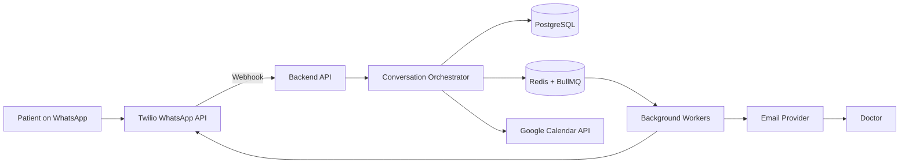

I’ll inspect the referenced architect brief first, then I’ll tailor the architecture and implementation plan to its conventions and constraints.

Read , lines 1 to 240

The brief emphasizes security-first, event-driven reliability, explicit schemas, observability, and horizontal scaling. The key design choice here is a modular monolith with durable background workers first: it keeps medical data and booking consistency manageable while preserving a clean path to split services later.

Read memory

# AI Medical Receptionist Architecture

## 1. Recommended Architecture

**Pattern:** Modular monolith with asynchronous workers  
**Communication:** REST APIs, webhooks, and event-driven jobs  
**Database:** PostgreSQL  
**Cache/queue:** Redis with BullMQ  
**Deployment:** Docker containers or managed cloud services

Start as one deployable backend with strict modules. Split services only when scale or team size justifies it.



### Core modules

1. **WhatsApp Gateway**
   - Receives and validates Twilio webhooks.
   - Sends messages through Twilio WhatsApp.
   - Supports Meta Cloud API through an adapter later if required.
   - Deduplicates inbound message IDs.

2. **Conversation and AI Orchestrator**
   - Maintains conversation state.
   - Extracts patient name, phone, illness description, and appointment intent.
   - Uses function/tool calls for deterministic operations:
     - `find_available_slots`
     - `book_appointment`
     - `cancel_appointment`
     - `reschedule_appointment`
   - Must never allow the language model to directly write arbitrary database values or book without server-side validation.

3. **Doctor and Calendar Module**
   - OAuth 2.0 connection to the doctor's Google account.
   - Stores encrypted refresh tokens.
   - Uses Google Calendar `freebusy.query` to find availability.
   - Creates events only after a final availability check.
   - Stores the Google event ID for reconciliation.

4. **Patient and Appointment Module**
   - Owns patient records, appointments, consent, and status transitions.
   - Uses PostgreSQL transactions and unique constraints to prevent double booking.

5. **Notification Module**
   - Schedules appointment reminders.
   - Sends WhatsApp reminder messages two hours before the appointment.
   - Retries transient failures and records delivery status.

6. **Summary Module**
   - Runs nightly at each doctor's configured local time.
   - Aggregates that day's appointments, cancellations, no-shows, and message failures.
   - Sends a summary email.

7. **Worker Module**
   - Processes delayed reminders, nightly summaries, retries, and calendar synchronization.
   - All jobs must be idempotent.

---

# 2. Suggested Technology Stack

## Backend

- **TypeScript**
- **NestJS** for modular architecture, dependency injection, validation, and testing
- **Prisma** or **Drizzle ORM**
- **Zod** or NestJS `class-validator` for request and tool validation
- **OpenAPI/Swagger** for API documentation

## Integrations

- **Twilio WhatsApp API** initially
- **Meta WhatsApp Cloud API adapter** as an alternative provider
- **Google Calendar API**
- **Google OAuth 2.0**
- **Resend, SendGrid, or Amazon SES** for email
- **OpenAI or another approved LLM provider** with healthcare data processing terms where required

Do not send protected health information to an AI provider unless the provider contract, configuration, retention policy, and compliance requirements are appropriate for the deployment.

## Infrastructure

- **PostgreSQL**: primary database
- **Redis**: queue and short-lived conversation state
- **BullMQ**: delayed jobs and retries
- **Docker**
- **AWS ECS/Fargate, Render, Fly.io, or Google Cloud Run**
- **AWS Secrets Manager, GCP Secret Manager, or Doppler**
- **Sentry + OpenTelemetry + cloud logging**
- **Terraform** for repeatable infrastructure

---

# 3. Database Schema

A patient is separate from an appointment because one patient can have many appointments.

```sql
CREATE EXTENSION IF NOT EXISTS pgcrypto;

CREATE TYPE appointment_status AS ENUM (
    'pending',
    'confirmed',
    'cancelled',
    'completed',
    'no_show'
);

CREATE TYPE message_direction AS ENUM ('inbound', 'outbound');

CREATE TYPE message_status AS ENUM (
    'received',
    'queued',
    'sent',
    'delivered',
    'failed'
);

CREATE TABLE doctors (
    id UUID PRIMARY KEY DEFAULT gen_random_uuid(),
    email VARCHAR(320) NOT NULL UNIQUE,
    full_name VARCHAR(200) NOT NULL,
    timezone VARCHAR(100) NOT NULL DEFAULT 'UTC',
    summary_enabled BOOLEAN NOT NULL DEFAULT TRUE,
    summary_local_time TIME NOT NULL DEFAULT '20:00',
    created_at TIMESTAMPTZ NOT NULL DEFAULT now(),
    updated_at TIMESTAMPTZ NOT NULL DEFAULT now()
);

CREATE TABLE patients (
    id UUID PRIMARY KEY DEFAULT gen_random_uuid(),
    doctor_id UUID NOT NULL REFERENCES doctors(id),
    name VARCHAR(200) NOT NULL,
    phone_e164 VARCHAR(20) NOT NULL,
    major_illness TEXT,
    consent_status BOOLEAN NOT NULL DEFAULT FALSE,
    created_at TIMESTAMPTZ NOT NULL DEFAULT now(),
    updated_at TIMESTAMPTZ NOT NULL DEFAULT now(),
    UNIQUE (doctor_id, phone_e164)
);

CREATE TABLE calendar_connections (
    id UUID PRIMARY KEY DEFAULT gen_random_uuid(),
    doctor_id UUID NOT NULL UNIQUE REFERENCES doctors(id),
    google_account_email VARCHAR(320),
    calendar_id VARCHAR(255) NOT NULL,
    encrypted_refresh_token TEXT NOT NULL,
    scopes TEXT[] NOT NULL,
    connected_at TIMESTAMPTZ NOT NULL DEFAULT now(),
    revoked_at TIMESTAMPTZ
);

CREATE TABLE appointments (
    id UUID PRIMARY KEY DEFAULT gen_random_uuid(),
    doctor_id UUID NOT NULL REFERENCES doctors(id),
    patient_id UUID NOT NULL REFERENCES patients(id),
    starts_at TIMESTAMPTZ NOT NULL,
    ends_at TIMESTAMPTZ NOT NULL,
    timezone VARCHAR(100) NOT NULL,
    status appointment_status NOT NULL DEFAULT 'pending',
    illness_snapshot TEXT,
    google_event_id VARCHAR(255),
    reminder_job_id VARCHAR(255),
    reminder_sent_at TIMESTAMPTZ,
    created_at TIMESTAMPTZ NOT NULL DEFAULT now(),
    updated_at TIMESTAMPTZ NOT NULL DEFAULT now(),
    CHECK (ends_at > starts_at)
);

CREATE TABLE conversations (
    id UUID PRIMARY KEY DEFAULT gen_random_uuid(),
    doctor_id UUID NOT NULL REFERENCES doctors(id),
    patient_id UUID REFERENCES patients(id),
    channel VARCHAR(30) NOT NULL DEFAULT 'whatsapp',
    state JSONB NOT NULL DEFAULT '{}',
    last_message_at TIMESTAMPTZ,
    created_at TIMESTAMPTZ NOT NULL DEFAULT now()
);

CREATE TABLE messages (
    id UUID PRIMARY KEY DEFAULT gen_random_uuid(),
    conversation_id UUID NOT NULL REFERENCES conversations(id),
    provider_message_id VARCHAR(255) UNIQUE,
    direction message_direction NOT NULL,
    status message_status NOT NULL,
    body TEXT NOT NULL,
    provider_error_code VARCHAR(100),
    sent_at TIMESTAMPTZ,
    created_at TIMESTAMPTZ NOT NULL DEFAULT now()
);

CREATE TABLE notification_jobs (
    id UUID PRIMARY KEY DEFAULT gen_random_uuid(),
    appointment_id UUID NOT NULL REFERENCES appointments(id),
    type VARCHAR(50) NOT NULL,
    scheduled_for TIMESTAMPTZ NOT NULL,
    status VARCHAR(30) NOT NULL DEFAULT 'scheduled',
    attempts INTEGER NOT NULL DEFAULT 0,
    last_error TEXT,
    processed_at TIMESTAMPTZ,
    UNIQUE (appointment_id, type)
);

CREATE TABLE audit_logs (
    id UUID PRIMARY KEY DEFAULT gen_random_uuid(),
    doctor_id UUID REFERENCES doctors(id),
    actor_type VARCHAR(30) NOT NULL,
    actor_id VARCHAR(255),
    action VARCHAR(100) NOT NULL,
    entity_type VARCHAR(100) NOT NULL,
    entity_id UUID,
    metadata JSONB,
    created_at TIMESTAMPTZ NOT NULL DEFAULT now()
);

CREATE INDEX idx_patients_phone
    ON patients (doctor_id, phone_e164);

CREATE INDEX idx_appointments_doctor_time
    ON appointments (doctor_id, starts_at);

CREATE INDEX idx_appointments_patient
    ON appointments (patient_id, starts_at);

CREATE INDEX idx_notification_jobs_due
    ON notification_jobs (scheduled_for)
    WHERE status = 'scheduled';

CREATE INDEX idx_messages_conversation
    ON messages (conversation_id, created_at);
```

For stronger double-booking protection, add a PostgreSQL exclusion constraint using `tstzrange` so confirmed appointments for the same doctor cannot overlap.

---

# 4. Appointment Booking Flow

1. Patient sends a WhatsApp message.
2. Twilio calls `POST /webhooks/twilio/whatsapp`.
3. Backend validates the Twilio signature.
4. The inbound provider message ID is checked for idempotency.
5. Conversation state is loaded.
6. AI extracts intent and missing information.
7. Backend validates all extracted fields.
8. Calendar module queries Google Calendar availability.
9. Bot returns a small set of available slots.
10. Patient selects a slot.
11. Backend performs a second availability check.
12. PostgreSQL transaction:
    - Creates or updates the patient.
    - Creates the appointment.
    - Creates the reminder job.
    - Writes an audit event.
13. Backend creates the Google Calendar event.
14. Appointment is marked `confirmed`.
15. Confirmation is sent to WhatsApp.

If Google Calendar creation fails, the appointment should not remain confirmed. Use an explicit compensation path or an outbox worker to retry safely.

---

# 5. API Surface

```text
POST   /api/v1/webhooks/twilio/whatsapp
GET    /api/v1/auth/google/start
GET    /api/v1/auth/google/callback

GET    /api/v1/doctors/me
PATCH  /api/v1/doctors/me/settings

GET    /api/v1/availability?from=...&to=...
POST   /api/v1/appointments
PATCH  /api/v1/appointments/:id/cancel
PATCH  /api/v1/appointments/:id/reschedule

GET    /api/v1/patients
GET    /api/v1/patients/:id
GET    /api/v1/audit-logs
```

Protect doctor-facing endpoints with authentication and role-based authorization. Webhook endpoints use provider signature verification rather than normal user authentication.

---

# 6. Folder Structure

```text
src/
├── main.ts
├── app.module.ts
├── config/
│   ├── configuration.ts
│   └── env.validation.ts
├── common/
│   ├── auth/
│   ├── errors/
│   ├── logging/
│   ├── database/
│   └── idempotency/
├── modules/
│   ├── doctors/
│   │   ├── doctors.controller.ts
│   │   ├── doctors.service.ts
│   │   └── dto/
│   ├── patients/
│   ├── appointments/
│   ├── conversations/
│   ├── messages/
│   ├── calendar/
│   │   ├── google-calendar.client.ts
│   │   ├── calendar.service.ts
│   │   └── oauth.service.ts
│   ├── whatsapp/
│   │   ├── whatsapp.provider.ts
│   │   ├── twilio.provider.ts
│   │   └── meta.provider.ts
│   ├── ai/
│   │   ├── agent.service.ts
│   │   ├── tools/
│   │   └── prompts/
│   ├── notifications/
│   ├── summaries/
│   └── audit/
├── workers/
│   ├── reminder.worker.ts
│   ├── summary.worker.ts
│   ├── calendar-sync.worker.ts
│   └── retry.worker.ts
├── prisma/
│   ├── schema.prisma
│   └── migrations/
└── health/
    └── health.controller.ts
```

---

# 7. Worker Scheduling

### Appointment reminders

When an appointment is confirmed:

```text
reminder_time = appointment.starts_at - 2 hours
```

- Create a BullMQ delayed job.
- Store the job ID in `appointments.reminder_job_id`.
- Do not send if the appointment is cancelled.
- Use an idempotency key such as `appointment:{id}:reminder`.
- Retry transient provider failures with exponential backoff.
- Move permanent failures to a dead-letter queue.

### Daily summaries

Each doctor has:

```text
timezone
summary_enabled
summary_local_time
```

A scheduler runs every few minutes and finds doctors whose local time matches the configured summary time. It creates a unique summary job for that doctor's local calendar day.

The email should include:

- Total appointments
- Confirmed, cancelled, completed, and no-show counts
- Patient names and appointment times
- Illness information only if necessary and permitted
- Message delivery failures
- Booking errors requiring attention

Avoid putting sensitive medical information in the email subject or unprotected email body unless the doctor's compliance policy explicitly permits it.

---

# 8. Security and Compliance Requirements

Because this handles health information, compliance must be designed before production:

- Use HTTPS everywhere.
- Encrypt database storage and backups.
- Encrypt Google refresh tokens using KMS-managed keys.
- Never log message bodies, illness details, OAuth tokens, or full phone numbers.
- Apply least-privilege IAM roles.
- Use provider webhook signature validation.
- Add rate limiting and replay protection.
- Add tenant isolation using `doctor_id` on every business table.
- Maintain immutable audit logs for access, booking, cancellation, and data changes.
- Support patient consent, data export, correction, and deletion workflows.
- Define retention and deletion policies.
- Sign required Business Associate Agreements where HIPAA applies.
- Verify that Twilio, Google, email, hosting, database, and AI providers support the required compliance posture.
- Keep the AI strictly administrative. It must not diagnose, prescribe, triage emergencies, or replace medical advice.

Emergency messages should receive a fixed response directing the patient to local emergency services or the doctor's approved urgent-care process.

---

# 9. Delivery Plan

## Phase 1: Foundation

- Create NestJS project.
- Configure PostgreSQL, Redis, migrations, secrets, and logging.
- Add doctor authentication.
- Add patient and appointment models.
- Add API validation and audit logging.

## Phase 2: Google Calendar

- Implement Google OAuth.
- Encrypt and store refresh tokens.
- Implement free/busy lookup.
- Implement event creation, cancellation, and rescheduling.
- Add concurrency protection and calendar failure recovery.

## Phase 3: WhatsApp

- Create Twilio WhatsApp sender.
- Implement signed webhook validation.
- Add inbound message idempotency.
- Implement deterministic conversation state.
- Add booking and cancellation flows without AI first.

## Phase 4: AI Layer

- Add intent classification and structured extraction.
- Expose only validated backend tools.
- Add prompt-injection defenses.
- Add fallback responses and human escalation.
- Test ambiguous dates, time zones, duplicate messages, and incomplete information.

## Phase 5: Notifications

- Add BullMQ workers.
- Schedule two-hour reminders.
- Add cancellation checks, retries, dead-letter handling, and delivery tracking.

## Phase 6: Daily Summaries

- Add configurable doctor timezone and summary time.
- Generate daily appointment summaries.
- Send through SES, Resend, or SendGrid.
- Add summary history and failure alerts.

## Phase 7: Production Hardening

- Add integration and end-to-end tests.
- Configure backups and disaster recovery.
- Add metrics, tracing, alerting, and health checks.
- Run dependency, container, and penetration scans.
- Load-test webhook processing and concurrent booking.
- Complete compliance review before handling real patient data.

This design gives you reliable booking and notification behavior even if the AI provider, WhatsApp provider, or Google Calendar has a temporary outage.